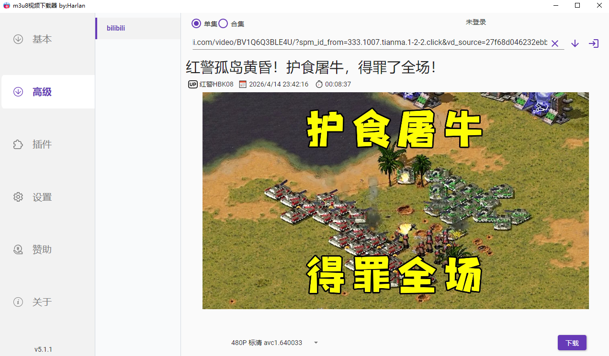
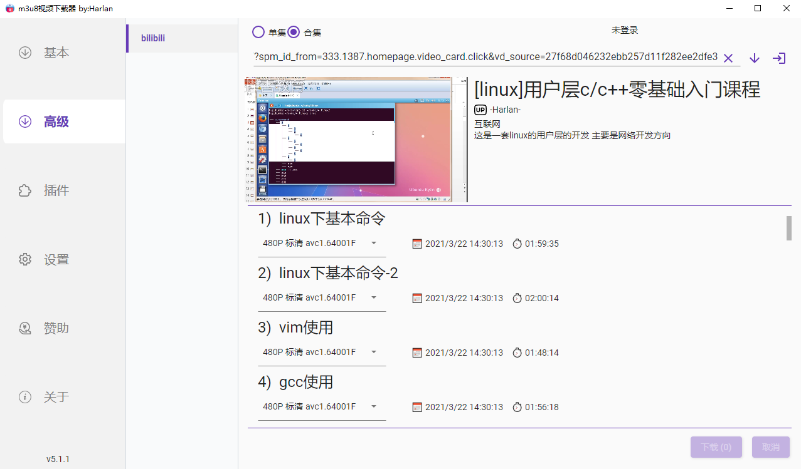

# M3u8Downloader_H.bilibili
此项目为M3u8Downloader_H下载器的b站下载插件,目前为最初版只实现了基础bv开头的视频下载，此项目无需单独下载

# 使用步骤
1. 首先下载[M3u8Downloader_H](https://github.com/Harlan-H/M3u8Downloader_H/releases)
2. 在M3u8Downloader_H程序左边 插件 => 在线插件 选择此插件名字进行下载
3. 软件提示需要重启软件 重启一下软件
4. 点击本地插件 选择启动 
5. 点击高级 即可看到bilibili字样 点击及可看到下图的样子

# 插件使用须知
1. 软件左上角可以选择单集 合集等功能 
2. 如果你下载的视频是包含合集中 但是你只想下载这一个视频 那就点击单集 如果你需要下载整个合集 那就点击合集
3. 软件下载按钮旁边是登录按钮 使用cookie方式进行登录 登录后可以下载更高清晰度的视频

# 截图

